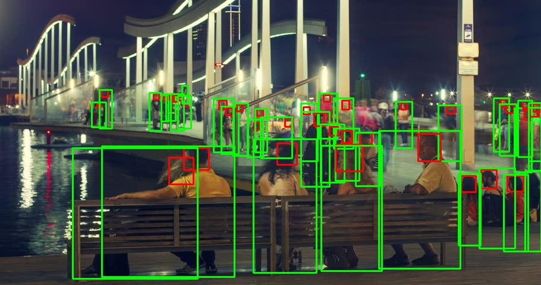
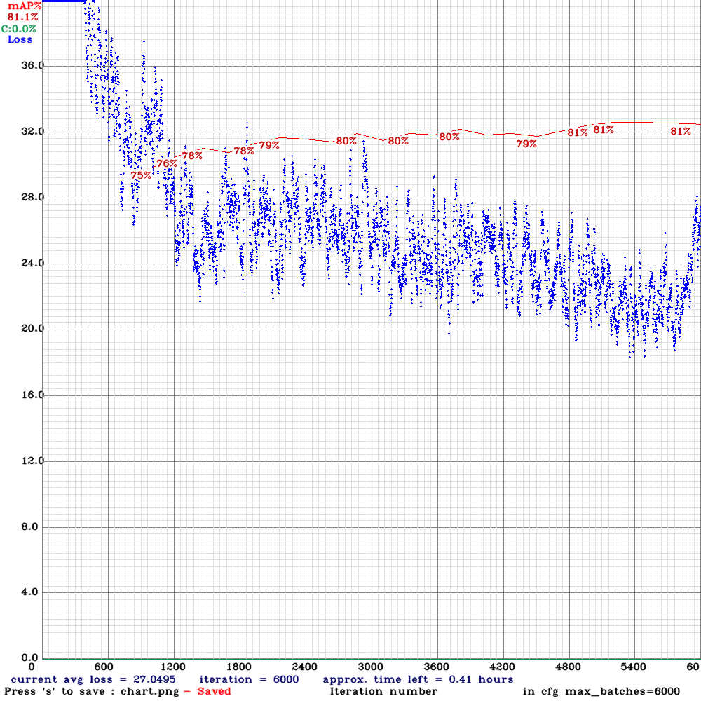
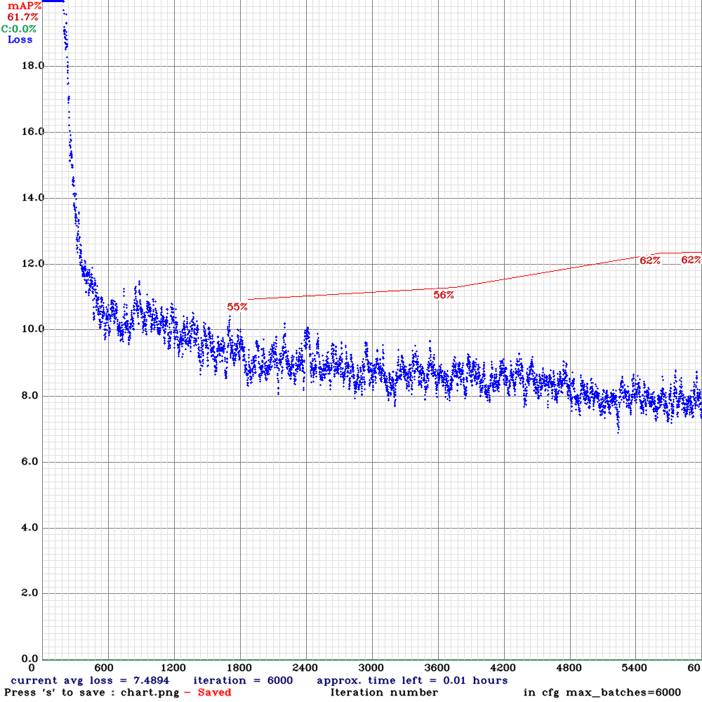
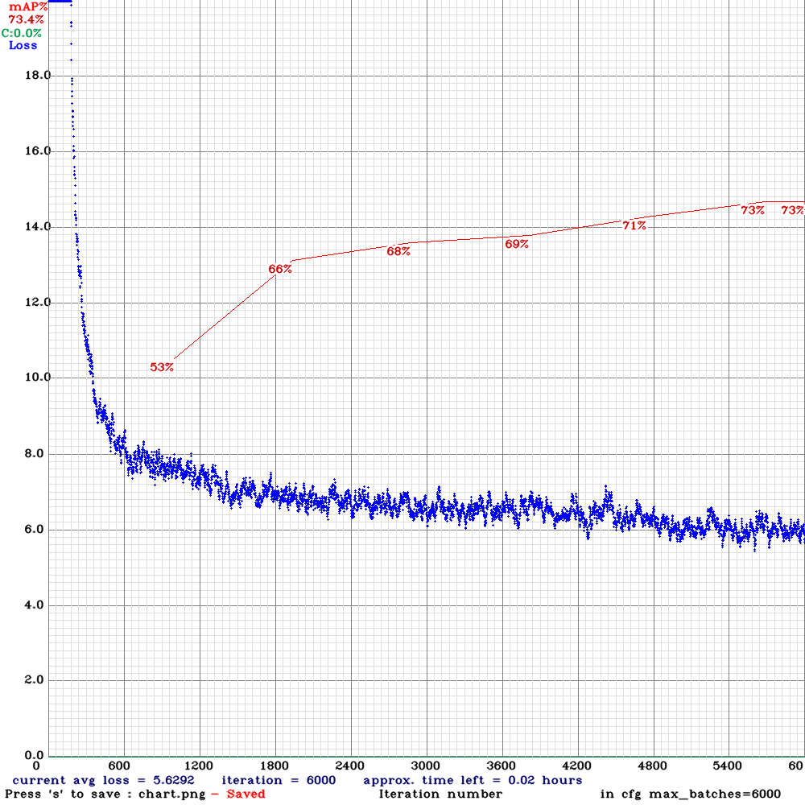
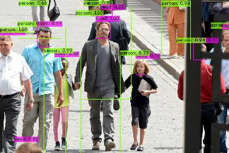
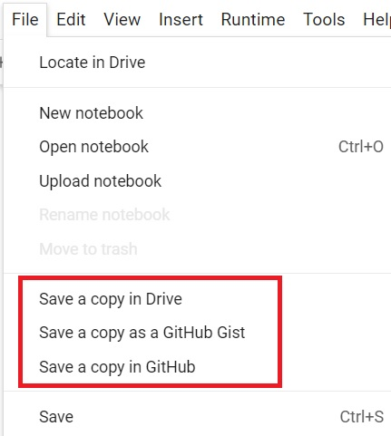

YOLOv4 CrowdHuman Tutorial
==========================

This is a tutorial demonstrating how to train a YOLOv4 people detector using [Darknet](https://github.com/AlexeyAB/darknet) and the [CrowdHuman dataset](https://www.crowdhuman.org/).

Table of contents
-----------------

* [Setup](#setup)
* [Preparing training data](#preparing)
* [Training on a local PC](#training-locally)
* [Testing the custom-trained yolov4 model](#testing)
* [Training on Google Colab](#training-colab)
* [Deploying onto Jetson Nano](#deploying)

<a name="setup"></a>
Setup
-----

If you are going to train the model on [Google Colab](https://colab.research.google.com/notebooks/intro.ipynb), you could skip this section and jump straight to [Training on Google Colab](#training-colab).

Otherwise, to run training locally, you need to have a x86_64 PC with a decent GPU.  For example, I mainly test the code in this repository using a desktop PC with:

* NVIDIA GeForce RTX 2080 Ti
* Ubuntu 18.04.5 LTS (x86_64)
    - CUDA 10.2
    - cuDNN 8.0.1

In addition, you should have OpenCV (including python3 "cv2" module) installed properly on the local PC since both the data preparation code and "darknet" would require it.

<a name="preparing"></a>
Preparing training data
-----------------------

For training on the local PC, I use a "608x608" yolov4 model as example.  Note that I use python3 exclusively in this tutorial (python2 might not work).  Follow these steps to prepare the "CrowdHuman" dataset for training the yolov4 model.

1. Clone this repository.

   ```shell
   $ cd ${HOME}/project
   $ git clone https://github.com/jkjung-avt/yolov4_crowdhuman
   ```

2. Run the "prepare_data.sh" script in the "data/" subdirectory.  It would download the "CrowdHuman" dataset, unzip train/val image files, and generate YOLO txt files necessary for the training.  You could refer to [data/README.md](data/README.md) for more information about the dataset.  You could further refer to [How to train (to detect your custom objects)](https://github.com/AlexeyAB/darknet#how-to-train-to-detect-your-custom-objects) for an explanation of YOLO txt files.

   ```shell
   $ cd ${HOME}/project/yolov4_crowdhuman/data
   $ ./prepare_data.sh 608x608
   ```

   This step could take quite a while, depending on your internet speed.  When it is done, all image files and ".txt" files for training would be in the "data/crowdhuman-608x608/" subdirectory.  (If interested, you could do `python3 verify_txts.py 608x608` to verify the generated txt files.)

   This tutorial is for training the yolov4 model to detect 2 classes of object: "head" (0) and "person" (1), where the "person" class corresponds to "full body" (including occluded body portions) in the original "CrowdHuman" annotations.  Take a look at "data/crowdhuman-608x608.data", "data/crowdhuman.names", and "data/crowdhuman-608x608/" to gain a better understanding of the data files that have been generated/prepared for the training.

   

<a name="training-locally"></a>
Training on a local PC
----------------------

Continuing from steps in the previous section, you'd be using the "darknet" framework to train the yolov4 model.

1. Download and build "darknet" code.  (NOTE to myself: Consider making "darknet" as a submodule and automate the build process?)

   ```shell
   $ cd ${HOME}/project/yolov4_crowdhuman
   $ git clone https://github.com/AlexeyAB/darknet.git
   $ cd darknet
   $ vim Makefile  # edit Makefile with your preferred editor (might not be vim)
   ```

   Modify the first few lines of the "Makefile" as follows.  Please refer to [How to compile on Linux (using make)](https://github.com/AlexeyAB/darknet#how-to-compile-on-linux-using-make) for more information about these settings.  Note that, in the example below, CUDA compute "75" is for RTX 2080 Ti and "61" is for GTX 1080.  You might need to modify those based on the kind of GPU you are using.

   ```
   GPU=1
   CUDNN=1
   CUDNN_HALF=1
   OPENCV=1
   AVX=1
   OPENMP=1
   LIBSO=1
   ZED_CAMERA=0
   ZED_CAMERA_v2_8=0

   ......

   USE_CPP=0
   DEBUG=0

   ARCH= -gencode arch=compute_61,code=[sm_61,compute_61] \
         -gencode arch=compute_75,code=[sm_75,compute_75]

   ......
   ```

   Then do a `make` to build "darknet".

   ```shell
   $ make
   ```

   When it is done, you could (optionally) test the "darknet" executable as follows.

   ```shell
   ### download pre-trained yolov4 coco weights and test with the dog image
   $ wget https://github.com/AlexeyAB/darknet/releases/download/darknet_yolo_v3_optimal/yolov4.weights \
          -q --show-progress --no-clobber
   $ ./darknet detector test cfg/coco.data cfg/yolov4-416.cfg yolov4.weights \
                             data/dog.jpg
   ```

2. Then copy over all files needed for training and download the pre-trained weights ("yolov4.conv.137").

   ```shell
   $ cd ${HOME}/project/yolov4_crowdhuman
   $ ./prepare_training.sh 608x608
   ```

3. Train the "yolov4-crowdhuman-608x608" model.  Please refer to [How to train with multi-GPU](https://github.com/AlexeyAB/darknet#how-to-train-with-multi-gpu) for how to fine-tune your training process.  For example, you could specify `-gpus 0,1,2,3` in order to use multiple GPUs to speed up training.

   ```shell
   $ cd ${HOME}/project/yolov4_crowdhuman/darknet
   $ ./darknet detector train data/crowdhuman-608x608.data \
                              cfg/yolov4-crowdhuman-608x608.cfg \
                              yolov4.conv.137 -map -gpus 0
   ```

   When the model is being trained, you could monitor its progress on the loss/mAP chart (since the `-map` option is used).  Alternatively, if you are training on a remote PC via ssh, add the `-dont_show -mjpeg_port 8090` option so that you could monitor the loss/mAP chart on a web browser (http://{IP address}:8090/).

   As a reference, training this "yolov4-crowdhuman-608x608" model with my RTX 2080 Ti GPU takes 17~18 hours.

   

   Another example for the training of "yolov4-tiny-crowdhuman-608x608" model on RTX 2080 Ti GPU (< 3 hours).

   

   And another one for the training of "yolov4-tiny-3l-crowdhuman-416x416" model on RTX 2080 Ti GPU (< 2 hours).

   

<a name="testing"></a>
Testing the custom-trained yolov4 model
---------------------------------------

After you have trained the "yolov4-crowdhuman-608x608" model locally, you could test the "best" custom-trained model like this.

   ```shell
   $ cd ${HOME}/project/yolov4_crowdhuman/darknet
   $ ./darknet detector test data/crowdhuman-608x608.data \
                             cfg/yolov4-crowdhuman-608x608.cfg \
                             backup/yolov4-crowdhuman-608x608_best.weights \
                             data/crowdhuman-608x608/273275,4e9d1000623d182f.jpg \
                             -gpus 0
   ```

   

In addition, you could verify mAP of the "best" model like this.

   ```
   $ ./darknet detector map data/crowdhuman-608x608.data \
                            cfg/yolov4-crowdhuman-608x608.cfg \
                            backup/yolov4-crowdhuman-608x608_best.weights \
                            -gpus 0
   ```

For example, I got mAP@0.50 = 0.814523 when I tested my own custom-trained "yolov4-crowdhuman-608x608" model.

   ```
    detections_count = 614280, unique_truth_count = 183365
   class_id = 0, name = head, ap = 82.60%           (TP = 65119, FP = 14590)
   class_id = 1, name = person, ap = 80.30%         (TP = 72055, FP = 11766)

    for conf_thresh = 0.25, precision = 0.84, recall = 0.75, F1-score = 0.79
    for conf_thresh = 0.25, TP = 137174, FP = 26356, FN = 46191, average IoU = 66.92 %

    IoU threshold = 50 %, used Area-Under-Curve for each unique Recall
    mean average precision (mAP@0.50) = 0.814523, or 81.45 %
   ```

<a name="training-colab"></a>
Training on Google Colab
------------------------

For doing training on Google Colab, I use a "416x416" yolov4 model as example.  I have put all data processing and training commands into an IPython Notebook.  So training the "yolov4-crowdhuman-416x416" model on Google Colab is just as simple as: (1) opening the Notebook on Google Colab, (2) mount your Google Drive, (3) run all cells in the Notebook.

A few words of caution before you begin running the Notebook on Google Colab:

* Google Colab's GPU runtime is *free of charge*, but it is **not unlimited nor guaranteed**.  Even though the Google Colab [FAQ](https://research.google.com/colaboratory/faq.html#resource-limits) states that *"virtual machines have maximum lifetimes that can be as much as 12 hours"*, I often saw my Colab GPU sessions getting disconnected after 7~8 hours of non-interactive use.

* If you connect to GPU instances on Google Colab repeatedly and frequently, you could be **temporarily locked out** (not able to connect to GPU instances for a couple of days).  So I'd suggest you to connect to a GPU runtime sparingly and only when needed, and to manually terminate the GPU sessions as soon as you no longer need them.

* It is strongly advised that you read and mind Google Colab's [Resource Limits](https://research.google.com/colaboratory/faq.html#resource-limits).

Due to the 7~8 hour limit of GPU runtime mentioned above, you won't be able to train a large yolov4 model in a single session.  That's the reason why I chose "416x416" model for this part of the tutorial.  Here are the steps:

1. Open [yolov4_crowdhuman.ipynb](https://colab.research.google.com/drive/1eoa2_v6wVlcJiDBh3Tb_umhm7a09lpIE?usp=sharing).  This IPython Notebook is on my personal Google Drive.  You could review it, but you could not modify it.

2. Make a copy of "yolov4_crowdhuman.ipynb" on your own Google Drive, by clicking "Files -> Save a copy in Drive" on the menu.  You should use your own saved copy of the Notebook for the rest of the steps.

   

3. Follow the instructions in the Notebook to train the "yolov4-crowdhuman-416x416" model, i.e.

   - make sure the IPython Notebook has successfully connected to a GPU runtime,
   - mount your Google Drive (for saving training log and weights),
   - run all cells ("Runtime -> Run all" or "Runtime -> Restart and run all").

   You should have a good chance of finishing training the "yolov4-crowdhuman-416x416" model before the Colab session gets automatically disconnected (expired).

Instead of opening the Colab Notebook on my Google Drive, you could also go to [your own Colab account](https://colab.research.google.com/notebooks/intro.ipynb) and use "File -> Upload notebook" to upload [yolov4_crowdhuman.ipynb](yolov4_crowdhuman.ipynb) directly.

Refer to my [Custom YOLOv4 Model on Google Colab](https://jkjung-avt.github.io/colab-yolov4/) post for additional information about running the IPython Notebook.

<a name="deploying"></a>
Deploying onto Jetson Nano
--------------------------

To deploy the trained "yolov4-crowdhuman-416x416" model onto Jsetson Nano, I'd use my [jkjung-avt/tensorrt_demos](https://github.com/jkjung-avt/tensorrt_demos) code to build/deploy it as a TensorRT engine.  Here are the detailed steps:

1. On the Jetson Nano, check out my [jkjung-avt/tensorrt_demos](https://github.com/jkjung-avt/tensorrt_demos) code and make sure you are able to run the standard "yolov4-416" TensorRT engine without problem.  Please refer to [Demo #5: YOLOv4](https://github.com/jkjung-avt/tensorrt_demos#yolov4) for details.

   ```shell
   $ cd ${HOME}/project
   $ git clone https://github.com/jkjung-avt/tensorrt_demos.git
   ### Detailed steps omitted: install pycuda, download yolov4-416 model, yolo_to_onnx, onnx_to_tensorrt
   ### ......
   $ cd ${HOME}/project/tensorrt_demos
   $ python3 trt_yolo.py --image ${HOME}/Pictures/dog.jpg -m yolov4-416
   ```

2. Download the "yolov4-crowdhuman-416x416" model.  More specifically, get "yolov4-crowdhuman-416x416.cfg" from this repository and download "yolov4-crowdhuman-416x416_best.weights" file from your Google Drive.  Rename the .weights file so that it matches the .cfg file.

   ```shell
   $ cd ${HOME}/project/tensorrt_demos/yolo
   $ wget https://raw.githubusercontent.com/jkjung-avt/yolov4_crowdhuman/master/cfg/yolov4-crowdhuman-416x416.cfg
   $ cp ${HOME}/Downloads/yolov4-crowdhuman-416x416_best.weights yolov4-crowdhuman-416x416.weights
   ```

   Then build the TensorRT (FP16) engine.  Note the "-c 2" in the command-line option is for specifying that the model is for detecting 2 classes of objects.

   ```shell
   $ python3 yolo_to_onnx.py -c 2 -m yolov4-crowdhuman-416x416
   $ python3 onnx_to_tensorrt.py -c 2 -m yolov4-crowdhuman-416x416
   ```

3. Test the TensorRT engine.  For example, I tested it with the "Avengers: Infinity War" movie trailer.  (You should download and test with your own images or videos.)

   ```shell
   $ cd ${HOME}/project/tensorrt_demos
   $ python3 trt_yolo.py --video ${HOME}/Videos/Infinity_War.mp4 \
                         -c 2 -m yolov4-crowdhuman-416x416
   ```

   (Click on the image below to see the whole video clip...)

   [](https://youtu.be/7Qr_Fq18FgM)

<a name="contributions"></a>
Contributions
--------------------------

[@philipp-schmidt](https://github.com/philipp-schmidt): yolov4-tiny models and training charts